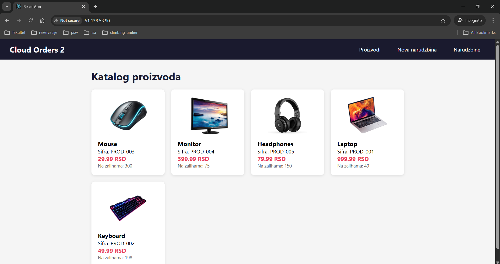
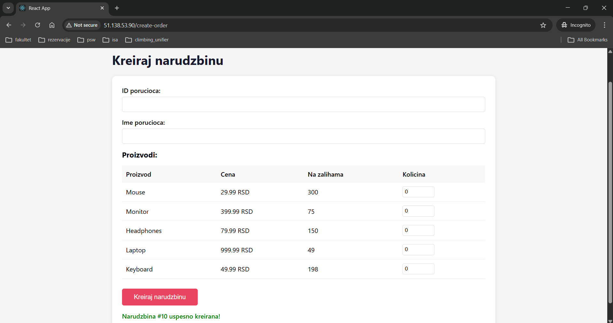
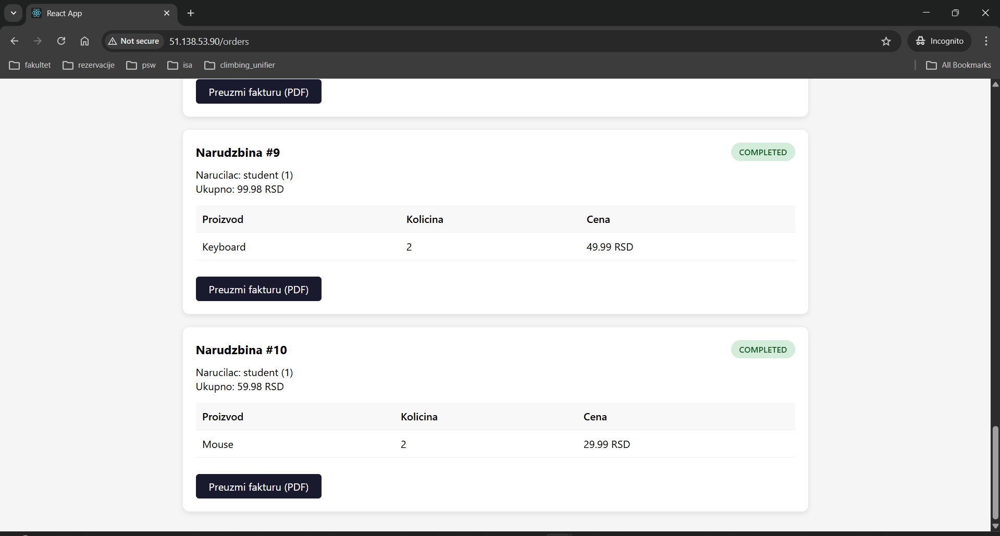
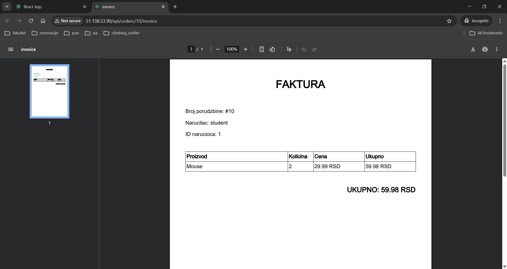

# Cloud Orders

A cloud-native ordering platform built with microservices, deployed on Azure Kubernetes Service. The system lets users browse products, place orders, and automatically generates PDF invoices in the background, without waiting.

## What it does

1. User browses a product catalog
2. User places an order
3. The system immediately confirms the order
4. A background worker picks up the order, generates a PDF invoice, and stores it
5. User download the invoice when it's ready

The key idea: ivoice generation happens **asynchronously**. The user doesn't wait for the PDF, the system handles it in the background through a message queue.

## Screenshots

### Product catalog


### Creating an order


### Downloading an invoice


### Generated inovice


## Architecture

The system is split into four components, each running independently

| Component | What it does | Runs on |
|---|---|---|
| **Catalog Service** | Manages products and stock levels | AKS |
| **Order Service** | Handles order creation, talks to Catalog Service internally | AKS |
| **Invoice Worker** | Reads from a message queue, generates PDFs, uploads them | Azure Container Apps |
| **Frontend** | React dashboard fro browsing, ordering and downloading invoices | AKS |

PostgreSQL runs as a StatefulSet on AKS with persistent storage, so data survives pod restarts.

```
┌──────────┐     ┌─────────────────┐      ┌─────────────────┐
│ Frontend │────▶│  Order Service  │────▶│ Catalog Service │
└──────────┘     └────────┬────────┘      └─────────────────┘
                          │
                          ▼
                  ┌───────────────┐      ┌────────────────┐
                  │  Azure Queue  │────▶│ Invoice Worker │
                  └───────────────┘      └────────┬───────┘
                                                 │
                                        ┌────────▼────────┐
                                        │  Blob Storage   │
                                        │  (PDF invoices) │
                                        └─────────────────┘
```

## Tech stack

**Backend:** Java 17, Spring Boot, Spring Data JPA, iText (PDF generation)

**Frontend:** React, Axios, React Router

**Database:** PostgreSQL (Kubernetes Stateful with PVC)

**Azure services:**
- **AKS** - runs the main services and database
- **Container Apps** - runs the invoice worker (scales to zero when idle)
- **Container Registry** - stores Docker images
- **Storage Account** - Queue Storage for async messaging, Blob Storage for PDFs and product images
- **Key Vault** - stores secrets (connection string, passwords), integrated with AKS via CSI Driver

**CI/CD:** GitHub Actions with four stages - test, build, deploy, post-deploy, verification with automatic rollback

## How it works

**Order flow:** When a user places an order, the Order Service first calls the Catalog Service (internal REST call) to verify stock and reduce quantities. Then it saves the order and drops a message into Azure Queue Storage. The user gets an immediate response.

**Invoice generation:** The Invoice Worker polls the queue. When it finds a message, it fetches the order details, generates a PDF with iText, uploads it to Blob Storage, and updates the order status to 'completed'. If the worker crashes, the message stays in the queue and gets retried.

**The use of Container Apps for qorker** - It supports scaling to zero replicas when the queue is empty (no const), and automatically spins up instances when messages arrive.

**Secrets management:** No secrets in the codebase. PostgreSQL credentials are created manually in the cluster. Storage connection strings and other secrets live in Azure Key Vault and are synced into Kubernetes via the Secrets Store CSI Driver.

## CI/CD pipeline

Every push to 'main' triggers:
1. **Test** - runs unit tests (Mockito, no database needed)
2. **Build** - builds Docker images, pushes to Azure COntainer Registry
3. **Deploy** - updates AKS deployment and COntainer Apps with new images, waits for rollout
4. **Verify** - runs integration tests against the live endpoint. If they fail, all deployments are automatically rolled back

## Running locally

Start the infrastructure:
```bash
docker-compose up --build
```

This spins up PostgreSQL, Azurite (local Azure Storage emulator), all three backend services and the frontend. Access it at `http://localhost:3000`.

## Project structure

```
├── catalog-service/       Spring Boot — product catalog API
├── order-service/         Spring Boot — order management API
├── invoice-worker/        Spring Boot — async PDF generation
├── frontend/              React dashboard
├── k8s/                   Kubernetes manifests
│   ├── namespace.yaml
│   ├── postgres-statefulset.yaml
│   ├── catalog-deployment.yaml
│   ├── order-deployment.yaml
│   ├── frontend-deployment.yaml
│   ├── secret-provider-class.yaml
│   └── ingress.yaml
├── docker-compose.yml
└── .github/workflows/
    └── deploy.yml         CI/CD pipeline
```
